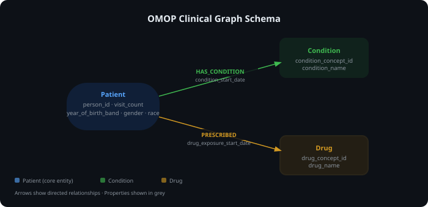

# Block 3: OMOP Clinical Graph Knowledge Base

A local Neo4j graph database built from Synthea-generated OMOP clinical data.
Models patients, conditions, and drugs as a property graph — enabling
relationship-heavy queries that flat tables cannot answer efficiently.
Runs 4 Cypher queries answering real clinical questions and exports patient
subgraphs as JSONL for Block 4 RAG ingestion (Pinecone).

## Graph schema



| Node | Key properties |
|---|---|
| `Patient` | `person_id`, `year_of_birth_band`, `gender`, `race`, `visit_count` |
| `Condition` | `condition_concept_id`, `condition_name` |
| `Drug` | `drug_concept_id`, `drug_name` |

| Relationship | Properties |
|---|---|
| `(Patient)-[:HAS_CONDITION]->(Condition)` | `condition_start_date` |
| `(Patient)-[:PRESCRIBED]->(Drug)` | `drug_exposure_start_date` |

## Setup

**Prerequisites:** Docker Desktop, Python 3.11, a `.env` file (copy from `.env.example`).

```bash
# 1. Start Neo4j
docker compose up -d

# 2. Create and activate virtual environment
python -m venv .venv
.venv\Scripts\activate      # Windows
# source .venv/bin/activate  # macOS/Linux

# 3. Install dependencies
pip install -r requirements.txt

# 4. Copy env template and set your password
cp .env.example .env
```

## Running

All commands must be run from the project root directory (genai-block3-graph-kb/), not from inside the scripts/ folder.

```bash
# Run all steps end-to-end
python scripts/run_all.py

# Or run steps individually
python scripts/check_connection.py   # verify Neo4j is reachable
python scripts/load_graph.py         # load OMOP CSVs into Neo4j
python scripts/query_graph.py        # print 4 clinical query results
python scripts/export_graph.py       # export patient subgraphs to JSONL
python scripts/verify.py             # confirm all node/rel counts pass
```

## Scripts

| Script | Purpose |
|---|---|
| `scripts/check_connection.py` | Smoke test — confirms Neo4j is reachable |
| `scripts/load_graph.py` | Loads OMOP CSVs into Neo4j via idempotent MERGE |
| `scripts/query_graph.py` | Runs Q1–Q4 Cypher queries and prints results |
| `scripts/export_graph.py` | Exports patient subgraphs as JSONL for Block 4 |
| `scripts/run_all.py` | Orchestrates all steps in sequence |
| `scripts/verify.py` | Validates node/relationship counts against source CSVs |

## Expected graph statistics

| Metric | Count |
|---|---|
| Patient nodes | 11,424 |
| Condition nodes | 3 |
| Drug nodes | 6 |
| HAS_CONDITION relationships | 4,818 |
| PRESCRIBED relationships | 4,323 |
| Export records (JSONL) | 11,424 |

## AI-assisted workflow

This project was built using Claude Code (claude-sonnet-4-6) as a coding assistant.
The workflow followed a spec → plan → tasks → code sequence across 5 phases,
with Claude generating scripts and docs, and the developer reviewing, running,
and validating each step before committing.
